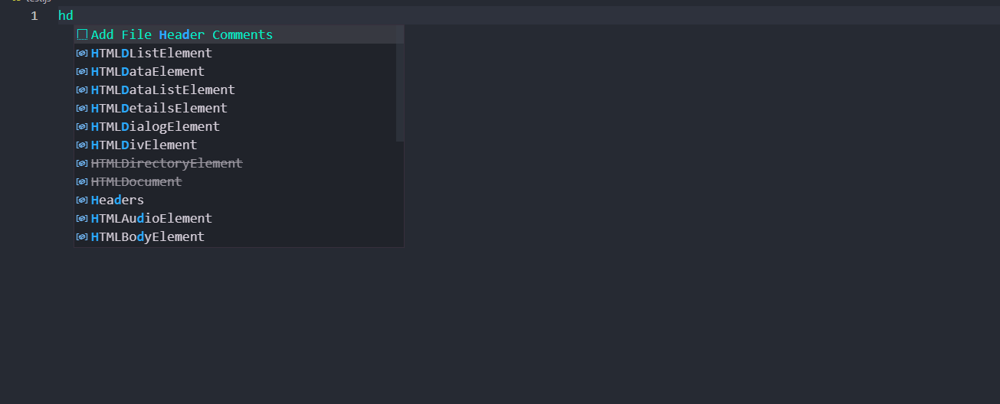
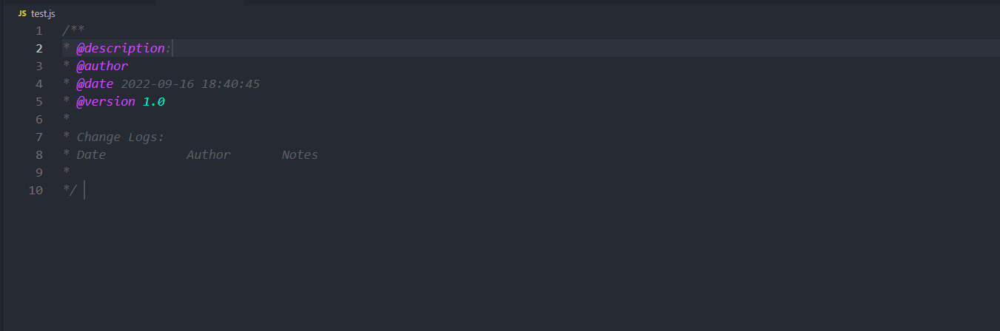
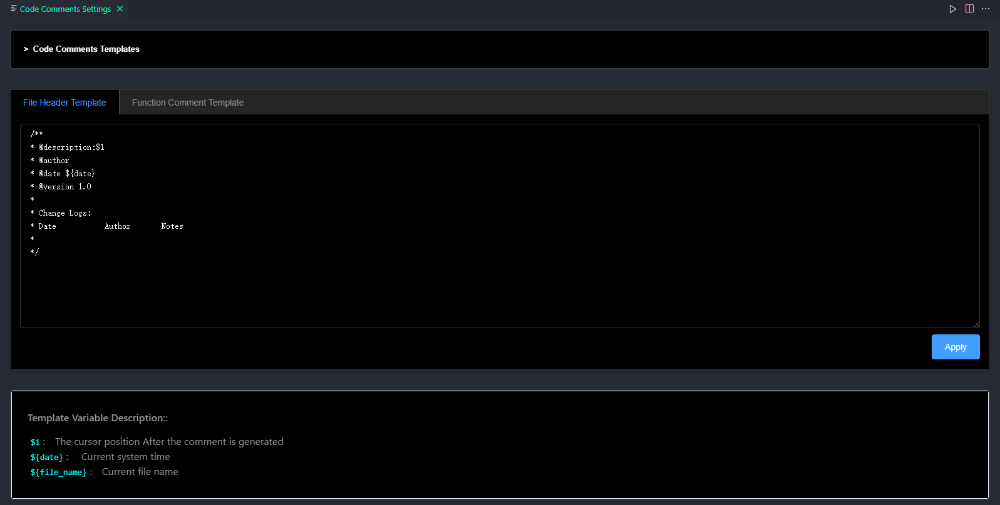

# Code-Commenter

## 项目目录结构

```js
├─vscode-end 							// vscode 端
│  ├─.vscode
│  ├─configuration						// 默认的注释配置
│  │  └─templates
│  ├─src								// vscode 端源码
│  │  ├─funnotes
│  │  ├─headnotes
│  │  ├─monitor
│  │  ├─notes
│  │  ├─snippets
│  │  ├─statistics
│  │  ├─utils
│  │  └─webview
│  ├─temp
│  └─web							   // web 端打包的资源 
│      └─template-settings
│          ├─css
│          ├─fonts
│          └─js
└─web-end							  // Web 端
    ├─public
    └─src
        ├─assets					  // 静态资源					
        │  └─languages
        ├─components
        ├─layout
        ├─router					  // 路由
        ├─themes					  // 样式主题
        │  └─element-#F48055
        │      └─fonts
        └─views
```

## 介绍

`Code-Commenter` 是一个基于 vscode 框架, 为 vscode 用户提供代码注释服务的扩展。在编辑器中, 支持` "c", "java", "go", "ts", "js", "cpp", "py" `后缀的文件.  与普通的注释工具不同的是, 此扩展可以让用户自定义不同的`场景`和`注释模板`, 实现代码注释的自由。

## 预览

- 编辑器提示

  

- 生成注释

  

- 自定义注释

  

## Vscode 端

- 技术栈: `Typescript` , `vscode 框架`, `Python`
- 开发工具: `vscode`
- 启动调式: `F5`
- 主要功能: `文件头注释提示`, `函数注释提示`, `自动生成注释代码`

## Web 端

- 技术栈：`Vue`, `Javascript`
- 开发工具: `vscode`
- 主要功能: `文件头注释配置`, `函数注释配置`, `UI 展示`

## Server 端 (暂未开源)

- 技术栈: `Gin`， `Golang`
- 开发工具: `GoLand`
- 主要功能: `统计使用情况与频率`